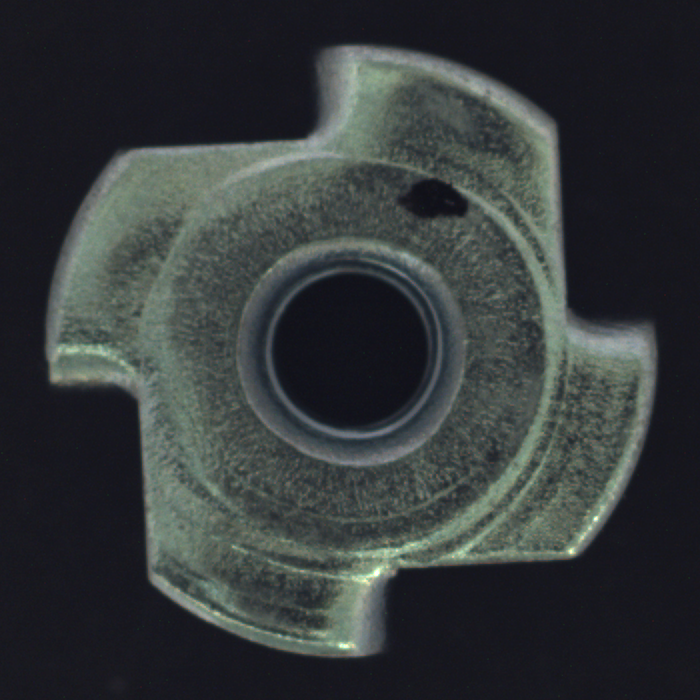
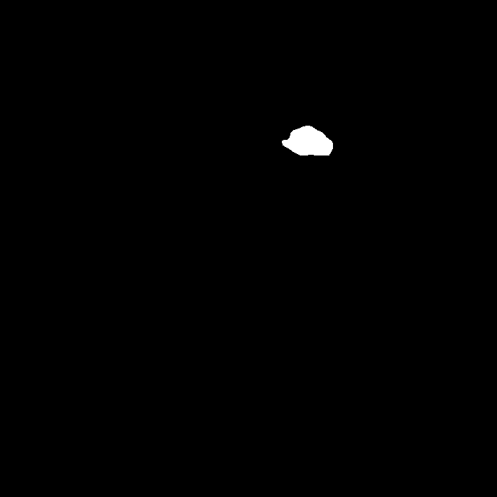
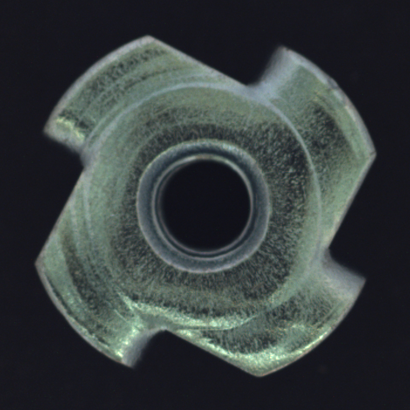
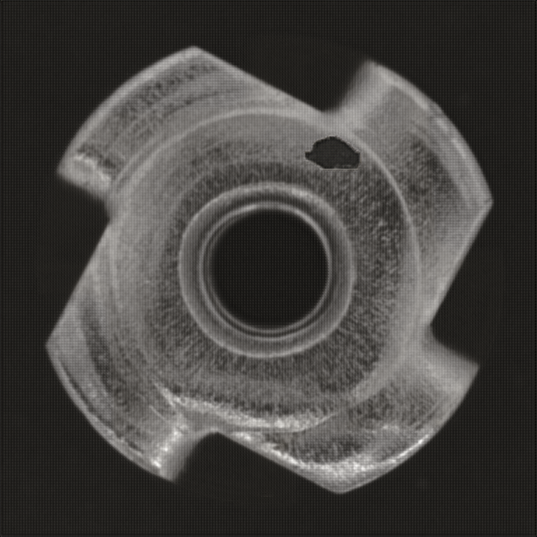

## DFTG - defect fusion transformer gan
With a generative adversarial network (CNN U-net framework), which can generate new defect images from normal images. This project is a simple implementation of defect fusion gan. 
### Data Preparation
1. make data folder
    ``` text
    data
    ├── train
    │   ├── image0.png
    │   └── image1.png
    |   └── ...
    └── trainannot
    │   ├── image0.png
    │   └── image1.png
    |   └── ...
    ```
2. annot are mask of defects, which are 0 for normal pixels and non-0 for defect pixels


### Train

* run `python train.py` to train the model

### Test
* run `python test.py` to test the model, here provides a pretrained weights [dftg.w](https://drive.google.com/drive/folders/1h3_KnAeCRTBU8yBQbf5QGCSkwOfi8YSh?usp=drive_link) with my own private dataset.

This is a MvTec test demo without training:
 defect
 mask
 target
 target result

### Notes
Recommended images in grayscale.